# ClipCap Transformer Mapping: luồng end-to-end và kiến thức thuyết trình

## 1. Mục tiêu tài liệu

Tài liệu này giải thích toàn bộ luồng Transformer Mapping trong nhánh ClipCap của dự án, từ CLIP image feature đến loss của GPT-2. Mục tiêu là giúp thành viên trong nhóm:

- Hiểu vấn đề mà Mapping Network phải giải quyết.
- Giải thích được vai trò của Linear Projection, image tokens và learnable prefix queries.
- Theo dõi chính xác shape của tensor qua từng bước.
- Hiểu Transformer Encoder đang học điều gì.
- Hiểu cách visual prefix được ghép với GPT-2.
- Phân biệt `attention_mask` và `labels`.
- Giải thích được luồng gradient khi GPT-2 bị freeze.
- Trình bày được lựa chọn thiết kế, giới hạn và hướng cải tiến trước giảng viên.

Tài liệu bám theo implementation hiện tại trong các file:

- [`clip_projection.py`](../src/clipcap/models/mapping_network/clip_projection.py)
- [`prefix_encoder.py`](../src/clipcap/models/mapping_network/prefix_encoder.py)
- [`transformer_mapper.py`](../src/clipcap/models/mapping_network/transformer_mapper.py)
- [`clipcap_model.py`](../src/clipcap/models/clipcap_model.py)
- [`clipcap_config.py`](../src/config/clipcap_config.py)

## 2. Bài toán tổng quát

CLIP và GPT-2 được huấn luyện cho hai loại dữ liệu khác nhau:

- CLIP image encoder nhận ảnh và tạo ra một vector biểu diễn nội dung ảnh.
- GPT-2 nhận một chuỗi embedding ngôn ngữ và dự đoán token tiếp theo.

Với cấu hình hiện tại:

```text
CLIP image feature: [B, 512]
GPT-2 token embedding: [B, L, 768]
```

Trong đó:

- `B` là batch size.
- `L` là chiều dài caption sau tokenization.
- `512` là `projection_dim` của `openai/clip-vit-base-patch32`.
- `768` là hidden size của `openai-community/gpt2`.

Không thể nối trực tiếp `[B, 512]` vào `[B, L, 768]` vì:

1. Hai tensor có số chiều khác nhau: một bên là vector, một bên là sequence.
2. Feature dimension `512` không bằng GPT-2 embedding dimension `768`.
3. GPT-2 cần một chuỗi embedding để dùng làm ngữ cảnh, không phải một vector CLIP đơn lẻ.

Mapping Network giải quyết bài toán:

```text
[B, 512] -> [B, P, 768]
```

Với cấu hình hiện tại `P = 10`:

```text
[B, 512] -> [B, 10, 768]
```

Mười vector đầu ra được gọi là visual prefix hoặc soft prefix. Chúng không phải token ID trong vocabulary của GPT-2. Chúng là các embedding liên tục, được học để biểu diễn nội dung ảnh trong không gian đầu vào của GPT-2.

## 3. Sơ đồ end-to-end

```mermaid
flowchart LR
    A[Image] --> B[CLIP image encoder]
    B --> C[Global CLIP feature B x 512]
    C --> D[Linear Projection]
    D --> E[Image tokens B x 10 x 768]
    F[Learnable prefix queries 10 x 768] --> G[Expand theo batch]
    E --> H[Concat image tokens và prefix queries]
    G --> H
    H --> I[Transformer Encoder]
    I --> J[Encoded sequence B x 20 x 768]
    J --> K[Lấy 10 vị trí cuối]
    K --> L[Visual prefix B x 10 x 768]
    M[Caption input_ids B x L] --> N[GPT-2 embedding layer]
    N --> O[Text embeddings B x L x 768]
    L --> P[Concat visual prefix và text embeddings]
    O --> P
    P --> Q[GPT-2 inputs_embeds B x 10+L x 768]
    Q --> R[GPT-2 causal language model]
    R --> S[Logits và caption loss]
```



Luồng rút gọn:

```text
Image
  -> CLIP
  -> global image feature
  -> Linear Projection
  -> image tokens
  -> concat learnable prefix queries
  -> Transformer Encoder
  -> visual prefix
  -> concat GPT-2 text embeddings
  -> GPT-2
  -> caption loss hoặc generated caption
```

## 4. Ký hiệu sử dụng trong tài liệu

| Ký hiệu | Ý nghĩa | Cấu hình hiện tại |
|---|---|---:|
| `B` | Batch size | Thay đổi theo batch |
| `d_clip` | Chiều CLIP feature | `512` |
| `D` | GPT-2 embedding dimension | `768` |
| `C` | Số image tokens sau projection | `10` |
| `P` | Số prefix queries và prefix output | `10` |
| `L` | Chiều dài caption tokenized | Tối đa `48` trong config |
| `H` | Số attention heads | `8` |
| `N` | Số Transformer Encoder layers | `4` |
| `D_ff` | Feed-forward dimension | `4 x 768 = 3072` |
| `V` | Kích thước vocabulary GPT-2 | Phụ thuộc tokenizer |

Các giá trị `512` và `768` là kết quả của model hiện tại. Production code không nên giả định mọi CLIP đều trả `512` và mọi language model đều dùng `768`.

## 5. Bảng shape qua toàn bộ pipeline

| Bước | Tensor | Shape hiện tại |
|---|---|---|
| CLIP output | `clip_features` | `[B, 512]` |
| Linear output | `projected_features` | `[B, 10 x 768] = [B, 7680]` |
| Reshape | `image_tokens` | `[B, 10, 768]` |
| Prefix parameters | `prefix_const` | `[10, 768]` |
| Expand theo batch | `prefix_queries` | `[B, 10, 768]` |
| Concat trong Mapper | `concat_sequence` | `[B, 20, 768]` |
| Transformer output | `encoded_sequence` | `[B, 20, 768]` |
| Slice phần prefix | `prefix_embeddings` | `[B, 10, 768]` |
| Caption token IDs | `input_ids` | `[B, L]` |
| GPT-2 text embeddings | `text_embeddings` | `[B, L, 768]` |
| GPT-2 combined input | `inputs_embeds` | `[B, 10 + L, 768]` |
| Extended mask | `extended_attention_mask` | `[B, 10 + L]` |
| Extended labels | `extended_labels` | `[B, 10 + L]` |
| GPT-2 output | `logits` | `[B, 10 + L, V]` |
| Training objective | `loss` | Scalar |

Ba tensor đưa vào GPT-2 phải đồng bộ cùng sequence length:

```text
inputs_embeds.shape[1]
    == extended_attention_mask.shape[1]
    == extended_labels.shape[1]
    == P + L
```

## 6. Bước 1: CLIP tạo global image feature

Ảnh được đưa qua CLIP image encoder. Phần preprocessing đã lưu feature dưới dạng:

```text
clip_features: [B, d_clip]
```

Với model hiện tại:

```text
d_clip = 512
```

Điểm quan trọng:

- Đây là global image feature, tức một vector tóm tắt toàn ảnh.
- Nó không phải chuỗi patch tokens gốc của Vision Transformer.
- Mapping Network chỉ có thể khai thác thông tin còn tồn tại trong global feature.
- Nếu global feature đã làm mất một chi tiết không gian, Mapper không thể khôi phục hoàn toàn chi tiết đó.

Do đó, image tokens được Mapper tạo ra không nên bị hiểu nhầm là các vùng ảnh hoặc patch thật.

## 7. Bước 2: Linear Projection

### 7.1. Mục tiêu

`ClipProjection` biến đổi:

```text
[B, d_clip] -> [B, C x D] -> [B, C, D]
```

Với cấu hình hiện tại:

```text
[B, 512] -> [B, 7680] -> [B, 10, 768]
```

Code cốt lõi:

```python
self.projection = nn.Linear(
    in_features=clip_dim,
    out_features=clip_length * embedding_dim,
)

projected_features = self.projection(clip_features)
image_tokens = projected_features.reshape(
    batch_size,
    clip_length,
    embedding_dim,
)
```

### 7.2. Công thức

Với một image feature `x`:

```text
y = x W^T + b
```

Trong đó:

```text
x: [d_clip]
W: [C x D, d_clip]
b: [C x D]
y: [C x D]
```

Sau đó `y` được reshape thành `C` vector, mỗi vector có dimension `D`.

### 7.3. Vì sao cần Linear Projection?

Linear Projection giải quyết đồng thời hai vấn đề:

1. Đổi feature dimension từ không gian CLIP sang không gian GPT-2.
2. Biến một global vector thành một chuỗi image tokens để Transformer có thể xử lý.

Nếu chỉ chiếu `512 -> 768`, ta chỉ thu được:

```text
[B, 768]
```

Tensor này vẫn chưa phải sequence. Ta có thể thêm một chiều thành `[B, 1, 768]`, nhưng chỉ có một visual token nên khả năng biểu diễn ngữ cảnh bị hạn chế.

Nếu lặp lại cùng một vector 10 lần, cả 10 token ban đầu giống nhau. Linear `512 -> 10 x 768` cho phép mỗi slot sử dụng một nhóm trọng số khác nhau và học một cách diễn giải khác từ cùng global feature.

### 7.4. Linear Projection có tạo thêm thông tin mới không?

Không theo nghĩa thông tin quan sát được từ ảnh. Nó không thể tạo lại chi tiết đã mất trong CLIP feature. Nó học một phép tái biểu diễn phù hợp hơn cho GPT-2:

- Slot có thể thiên về đối tượng.
- Slot có thể thiên về hành động.
- Slot có thể thiên về thuộc tính hoặc bối cảnh.

Đây là cách diễn giải trực quan. Code không ép cứng từng slot phải mang một ý nghĩa cụ thể.

### 7.5. Số tham số

Với `d_clip=512`, `C=10`, `D=768`:

```text
weight = 512 x 7680
bias   = 7680

projection parameters
    = 512 x 7680 + 7680
    = 3,939,840
```

## 8. Image tokens là gì?

Image tokens là output sau Linear Projection và reshape:

```text
image_tokens: [B, C, D]
```

Với cấu hình hiện tại:

```text
image_tokens: [B, 10, 768]
```

Mỗi token:

- Phụ thuộc vào image feature của đúng sample trong batch.
- Có cùng dimension với GPT-2 embedding.
- Được sinh ra bởi một vùng tham số khác nhau trong Linear Projection.
- Chưa phải output cuối đưa vào GPT-2.

Image tokens đóng vai trò là dữ liệu ảnh mà prefix queries sẽ tương tác trong Transformer Encoder.

## 9. Bước 3: Learnable Prefix Queries

### 9.1. Khởi tạo

`PrefixTransformerEncoder` chứa một tham số học được:

```python
self.prefix_const = nn.Parameter(
    torch.empty(prefix_length, d_model)
)
```

Shape:

```text
[P, D] = [10, 768]
```

Tham số này được khởi tạo theo phân phối chuẩn:

```text
mean = 0.0
std  = 0.02
```

Khi forward, cùng một bộ query được expand theo batch:

```python
prefix_queries = self.prefix_const.unsqueeze(0).expand(
    batch_size,
    -1,
    -1,
)
```

Kết quả:

```text
[10, 768] -> [B, 10, 768]
```

### 9.2. Prefix queries có phụ thuộc ảnh ngay từ đầu không?

Không. Trước Transformer Encoder, chúng là cùng một bộ tham số cho mọi ảnh.

Sau khi được concat với image tokens và đi qua self-attention, output ở các vị trí prefix trở thành image-conditioned prefix. Nghĩa là cùng một query slot sẽ tạo output khác nhau cho các ảnh khác nhau.

### 9.3. Tại sao cần prefix queries?

Prefix queries cung cấp các output slots ổn định mà model có thể học cách ghi thông tin ảnh vào đó.

Có thể hình dung:

```text
image tokens = nguồn thông tin ảnh
prefix queries = các vị trí hỏi và tổng hợp thông tin
prefix outputs = visual context đưa vào GPT-2
```

Không nên hiểu mỗi query là một câu hỏi ngôn ngữ cố định. Ý nghĩa của query được học tự động từ caption loss.

### 9.4. Số tham số

```text
P x D = 10 x 768 = 7,680 parameters
```

## 10. Bước 4: Concat image tokens và prefix queries

Hai chuỗi được nối theo chiều sequence:

```python
concat_sequence = torch.cat(
    [image_tokens, prefix_queries],
    dim=1,
)
```

Shape tổng quát:

```text
[B, C, D] + [B, P, D] -> [B, C + P, D]
```

Shape hiện tại:

```text
[B, 10, 768] + [B, 10, 768] -> [B, 20, 768]
```

Thứ tự được cố định:

```text
[image token positions][prefix query positions]
```

Thứ tự này giải thích vì sao output cuối được lấy bằng:

```python
prefix_embeddings = encoded_sequence[:, clip_length:, :]
```

## 11. Bước 5: Transformer Encoder

### 11.1. Self-attention đang làm gì?

Với input sequence `X` có shape `[B, C + P, D]`, mỗi attention head tạo:

```text
Q = X W_Q
K = X W_K
V = X W_V
```

Attention:

```text
Attention(Q, K, V)
    = softmax(Q K^T / sqrt(d_head)) V
```

Với `D=768` và `H=8`:

```text
d_head = 768 / 8 = 96
```

Mỗi vị trí có thể tổng hợp thông tin từ toàn bộ 20 vị trí:

- Image token có thể tương tác với image token khác.
- Prefix query có thể đọc image tokens.
- Prefix query có thể tương tác với prefix query khác.
- Image tokens cũng có thể được cập nhật dựa trên prefix queries.

Sau nhiều layer, phần output ở prefix positions chứa thông tin ảnh đã được tổng hợp và biến đổi.

### 11.2. Multi-head attention có ý nghĩa gì?

Thay vì dùng một phép attention duy nhất, model chia dimension thành nhiều head. Mỗi head có bộ trọng số riêng và có thể tập trung vào một quan hệ khác nhau.

Ví dụ diễn giải:

- Head chú ý đến vật thể chính.
- Head chú ý đến hành động.
- Head chú ý đến thuộc tính.
- Head chú ý đến quan hệ hoặc bối cảnh.

Đây là cách diễn giải để thuyết trình, không phải ràng buộc cứng trong code.

### 11.3. Feed-forward network

Sau attention, mỗi position đi qua một feed-forward network độc lập:

```text
D -> D_ff -> D
```

Với cấu hình hiện tại:

```text
768 -> 3072 -> 768
```

Attention trộn thông tin giữa các positions. Feed-forward network biến đổi biểu diễn bên trong từng position.

### 11.4. Residual connection và normalization

`nn.TransformerEncoderLayer` bao gồm:

- Multi-head self-attention.
- Residual connection.
- Layer normalization.
- Feed-forward network.
- Dropout.

Residual connection giúp gradient truyền qua mạng sâu ổn định hơn. Layer normalization giúp giữ phân phối activation ổn định. Dropout giảm overfitting khi training.

### 11.5. Vì sao dùng Transformer Encoder thay vì Decoder?

Mapping Network không sinh token theo từng bước. Nó biến đổi một tập image tokens và prefix queries thành visual prefix trong một lần forward.

Do đó, các vị trí trong Mapper được phép nhìn nhau hai chiều. Transformer Encoder phù hợp hơn Transformer Decoder có causal masking.

### 11.6. Vì sao Mapper không dùng causal mask?

Causal mask chỉ cần khi dự đoán chuỗi tuần tự để ngăn một vị trí nhìn thấy tương lai.

Trong Mapper:

- Image tokens đã có sẵn cùng lúc.
- Prefix queries cũng có sẵn cùng lúc.
- Mục tiêu là tạo một biểu diễn điều kiện cho GPT-2, không phải dự đoán prefix query kế tiếp.

Vì vậy, Mapper không cần causal mask. Causal behavior được GPT-2 áp dụng ở giai đoạn language modeling.

### 11.7. Positional encoding trong implementation hiện tại

Mapper hiện tại không cộng explicit positional embedding trước Transformer Encoder.

Slot identity vẫn xuất hiện từ:

- Các block output khác nhau của Linear Projection.
- Các vector `prefix_const` khác nhau tại từng vị trí.
- Thứ tự concat cố định và bước slice cố định.

Tuy nhiên, không có positional encoding riêng là một giới hạn cần biết. Nếu thí nghiệm cho thấy model khó phân biệt cấu trúc vị trí, có thể nghiên cứu thêm learnable positional embedding.

## 12. Bước 6: Lấy P prefix embeddings cuối

Transformer trả:

```text
encoded_sequence: [B, C + P, D]
```

Trong đó:

```text
encoded_sequence[:, :C, :]  = encoded image-token positions
encoded_sequence[:, C:, :]  = encoded prefix-query positions
```

Model chỉ lấy phần prefix:

```python
prefix_embeddings = encoded_sequence[:, self.clip_length:, :]
```

Kết quả:

```text
[B, C + P, D] -> [B, P, D]
```

Với cấu hình hiện tại:

```text
[B, 20, 768] -> [B, 10, 768]
```

### Tại sao không lấy image tokens đầu?

Thiết kế hiện tại xem prefix-query positions là các output slots chuyên dùng cho GPT-2. Image-token positions chủ yếu đóng vai trò nguồn thông tin bên trong Mapper.

Việc chỉ lấy prefix positions tạo một interface rõ ràng:

```text
TransformerMapper output = [B, prefix_length, embedding_dim]
```

## 13. Tại sao chọn 10 image tokens và 10 prefix queries?

Số `10` là hyperparameter, không phải định luật của ClipCap.

Nếu số token quá nhỏ:

- Visual prefix có thể thiếu capacity.
- Quá nhiều thông tin ảnh phải nén vào ít vị trí.

Nếu số token quá lớn:

- Tăng memory và computation.
- Chiếm nhiều GPT-2 context positions.
- Có thể tăng nguy cơ overfitting.
- Không bảo đảm chất lượng tăng tương ứng.

Cấu hình `10/10` là baseline cân bằng để bắt đầu. Giá trị tốt nhất phải được xác nhận bằng validation metric và thí nghiệm ablation.

Không hard-code `10` trong logic tensor. Code luôn sử dụng:

```python
self.clip_length
self.prefix_length
prefix_embeddings.size(1)
```

## 14. Độ phức tạp và số tham số Mapper

### 14.1. Số tham số thực tế

Với cấu hình hiện tại:

| Thành phần | Trainable parameters |
|---|---:|
| Linear Projection | `3,939,840` |
| Learnable Prefix Queries | `7,680` |
| Bốn Transformer Encoder layers | `28,351,488` |
| Tổng phần Transformer gồm prefix | `28,359,168` |
| Tổng Mapper | `32,299,008` |

Phần lớn tham số nằm trong Transformer Encoder, đặc biệt là attention projections và feed-forward layers.

### 14.2. Độ phức tạp attention

Self-attention có độ phức tạp gần:

```text
O((C + P)^2 x D)
```

Với `C + P = 20`, sequence trong Mapper khá ngắn. Vì vậy chi phí attention theo sequence length vẫn kiểm soát được. Feed-forward layers và số lượng tham số có thể chiếm phần đáng kể hơn.

## 15. Bước 7: Ghép visual prefix với GPT-2

Dataset trả batch:

```python
batch = {
    "image_embed": image_embed,        # [B, d_clip]
    "input_ids": input_ids,            # [B, L]
    "attention_mask": attention_mask,  # [B, L]
}
```

Dataset không tạo hoặc trả `labels`.

Trong `ClipCaptionModel`:

```python
prefix_embeddings = mapper(image_embed)
# [B, P, D]

text_embeddings = gpt2.get_input_embeddings()(input_ids)
# [B, L, D]

inputs_embeds = torch.cat(
    [prefix_embeddings, text_embeddings],
    dim=1,
)
# [B, P + L, D]
```

Điều kiện bắt buộc:

```text
mapper.embedding_dim == gpt2 embedding_dim
```

Nếu hai chiều khác nhau, không thể concatenate và GPT-2 cũng không thể diễn giải prefix đúng không gian embedding.

### Giới hạn vị trí GPT-2

GPT-2 base hiện tại có tối đa `1024` positions. Vì prefix chiếm `P` positions:

```text
P + L <= 1024
```

Production code kiểm tra điều kiện này trước khi gọi GPT-2.

## 16. Extended attention mask

Caption attention mask ban đầu:

```text
attention_mask: [B, L]
```

Visual prefix là ngữ cảnh hợp lệ nên prefix mask phải bằng `1`:

```text
prefix_mask: [B, P] toàn giá trị 1
```

Ghép lại:

```text
[B, P] + [B, L] -> [B, P + L]
```

Ví dụ:

```text
P = 3

caption mask:  [1, 1, 1, 0, 0]
prefix mask:   [1, 1, 1]
extended mask: [1, 1, 1, 1, 1, 1, 0, 0]
```

Ý nghĩa:

- Prefix positions: GPT-2 được sử dụng làm ngữ cảnh.
- Caption token thật: GPT-2 được sử dụng làm ngữ cảnh.
- Padding: không được sử dụng như dữ liệu thật.

## 17. Extended labels

Labels chỉ được tạo khi training hoặc validation cần tính loss.

Quy tắc:

- Prefix labels bằng `-100`.
- Caption token hợp lệ giữ token ID.
- Caption padding labels bằng `-100`.

Ví dụ:

```text
P = 3

input_ids:       [21, 45, 86,    0,    0]
attention_mask:  [ 1,  1,  1,    0,    0]
caption labels:  [21, 45, 86, -100, -100]
prefix labels:   [-100, -100, -100]
extended labels: [-100, -100, -100, 21, 45, 86, -100, -100]
```

### Vì sao prefix attention mask là 1 nhưng prefix label là -100?

Hai tensor điều khiển hai việc khác nhau:

| Vị trí | Attention mask | Label | Được dùng làm ngữ cảnh | Được tính loss trực tiếp |
|---|---:|---:|---:|---:|
| Visual prefix | `1` | `-100` | Có | Không |
| Caption token thật | `1` | Token ID | Có | Có |
| Padding | `0` | `-100` | Không | Không |

Ghi nhớ:

```text
attention_mask quyết định model được đọc vị trí nào.
labels quyết định loss được chấm tại vị trí nào.
```

## 18. Causal language modeling và label shift

GPT-2 dự đoán token tiếp theo. Khi truyền `labels` vào Hugging Face GPT-2, model tự shift tương đương:

```python
shift_logits = logits[:, :-1, :]
shift_labels = labels[:, 1:]
```

Với sequence:

```text
[prefix_1, prefix_2, prefix_3, token_1, token_2, token_3]
```

Labels:

```text
[-100, -100, -100, token_1, token_2, token_3]
```

Sau internal shift:

- Output tại `prefix_3` dự đoán `token_1`.
- Output tại `token_1` dự đoán `token_2`.
- Output tại `token_2` dự đoán `token_3`.

Không tự shift labels trước khi truyền vào GPT-2. Nếu shift thủ công rồi GPT-2 shift thêm lần nữa, target sẽ lệch một vị trí.

## 19. Luồng training

Training call hiện tại:

```python
outputs = model(
    image_embed=batch["image_embed"],
    input_ids=batch["input_ids"],
    attention_mask=batch["attention_mask"],
    labels=batch["input_ids"],
)

loss = outputs.loss
loss.backward()
```

`labels=batch["input_ids"]` không có nghĩa Dataset lưu labels. `ClipCaptionModel` clone tensor này, thay padding bằng `-100`, thêm prefix labels và chỉ dùng bản extended để tính loss.

Luồng đầy đủ:

```text
image_embed
  -> TransformerMapper
  -> prefix_embeddings

input_ids
  -> GPT-2 embedding layer
  -> text_embeddings

prefix_embeddings + text_embeddings
  -> inputs_embeds

attention_mask
  -> extended_attention_mask

input_ids + attention_mask
  -> extended_labels

inputs_embeds + extended_attention_mask + extended_labels
  -> GPT-2
  -> loss
```

## 20. Luồng gradient và freeze GPT-2

Caption loss không được tính trực tiếp tại prefix positions vì labels ở đó bằng `-100`. Tuy nhiên prefix vẫn ảnh hưởng đến hidden states và dự đoán caption.

Luồng gradient:

```text
caption loss
  -> GPT-2 hidden states
  -> visual prefix embeddings
  -> Transformer Encoder
  -> learnable prefix queries
  -> Linear Projection
```

Khi freeze GPT-2:

```python
for parameter in gpt2.parameters():
    parameter.requires_grad = False
```

Kết quả:

- GPT-2 parameters không được optimizer cập nhật.
- Autograd vẫn tính gradient qua phép toán của GPT-2.
- Gradient vẫn truyền về visual prefix và Mapping Network.

Không bọc GPT-2 forward bằng `torch.no_grad()` khi đang train Mapper. `torch.no_grad()` sẽ cắt computational graph và Mapper không nhận gradient từ caption loss.

## 21. Luồng inference và generation

Khi inference không cần tính teacher-forcing loss nên không truyền labels:

```python
outputs = model(
    image_embed=batch["image_embed"],
    input_ids=batch["input_ids"],
    attention_mask=batch["attention_mask"],
)
```

Khi đó:

- Mapper vẫn tạo visual prefix.
- GPT-2 vẫn trả logits.
- `outputs.loss` là `None`.

Trong autoregressive generation:

1. Tạo prefix một lần từ ảnh.
2. Bắt đầu với prompt token hoặc token mở đầu.
3. GPT-2 dự đoán token tiếp theo.
4. Chọn token theo greedy, sampling hoặc beam search.
5. Nối token mới vào sequence.
6. Cập nhật attention mask.
7. Lặp đến EOS hoặc giới hạn độ dài.

Không cần chạy lại CLIP và Mapper ở mỗi decoding step nếu ảnh không đổi. Prefix có thể được tính một lần và tái sử dụng.

## 22. Lấy dimension động, không hard-code model

Các con số `512` và `768` chỉ đúng với model hiện tại. Khi thay CLIP hoặc GPT-2, nên lấy dimension từ dữ liệu và model:

```python
clip_dim = int(batch["image_embed"].shape[-1])

embedding_dim = int(
    gpt2.get_input_embeddings().embedding_dim
)
```

Khởi tạo Mapper:

```python
mapper = TransformerMapper(
    clip_dim=clip_dim,
    embedding_dim=embedding_dim,
)
```

`TransformerMapper` kiểm tra:

- `clip_dim`, `embedding_dim`, lengths, layers và heads là số nguyên dương.
- `embedding_dim` chia hết cho `num_heads`.
- `dropout` nằm trong `[0, 1)`.
- `feedforward_dim` hợp lệ nếu được cung cấp.

## 23. Vai trò từng file production

### `clip_projection.py`

Sở hữu:

```text
[B, d_clip] -> [B, C, D]
```

Trách nhiệm:

- Validate CLIP feature shape.
- Linear projection.
- Reshape thành image tokens.

### `prefix_encoder.py`

Sở hữu:

```text
image tokens + prefix queries -> encoded sequence
```

Trách nhiệm:

- Khởi tạo learnable prefix queries.
- Expand queries theo batch.
- Concat với image tokens.
- Chạy Transformer Encoder.

### `transformer_mapper.py`

Sở hữu interface end-to-end của Mapper:

```text
[B, d_clip] -> [B, P, D]
```

Trách nhiệm:

- Ghép `ClipProjection` và `PrefixTransformerEncoder`.
- Validate cấu hình.
- Slice đúng prefix outputs.
- Thống kê trainable parameters.

### `clipcap_model.py`

Sở hữu tích hợp Mapper với GPT-2.

Trách nhiệm:

- Tạo text embeddings.
- Ghép visual prefix với text embeddings.
- Mở rộng attention mask.
- Chỉ tạo labels khi cần loss.
- Kiểm tra sequence length, device, dtype và embedding dimension.
- Gọi GPT-2.

### `clipcap_config.py`

Sở hữu model names và hyperparameters chung:

- Mapper lengths.
- Số layers và heads.
- Feed-forward multiplier.
- Dropout.
- Prefix initialization.
- Training configuration.

## 24. Những invariant bắt buộc

### Mapping Network

- Input có shape `[B, d_clip]`.
- Linear output reshape được thành `[B, C, D]`.
- Prefix queries có shape `[B, P, D]` sau expand.
- Encoder input và output có shape `[B, C + P, D]`.
- Mapper output có shape `[B, P, D]`.
- Output không chứa `NaN` hoặc `Inf`.

### GPT-2 integration

- Mapper output dimension bằng GPT-2 embedding dimension.
- `inputs_embeds`, mask và labels cùng batch size.
- Ba tensor cùng sequence length `P + L`.
- Prefix mask bằng `1`.
- Prefix labels bằng `-100`.
- Padding labels bằng `-100`.
- `input_ids` dùng dtype `torch.long`.
- Tensor nằm cùng device.
- `P + L` không vượt GPT-2 position limit.

### Training

- Loss tồn tại và hữu hạn khi truyền labels.
- Không có loss khi `labels=None`.
- Gradient truyền về Mapper.
- Khi GPT-2 freeze, GPT-2 parameters không có gradient nhưng Mapper vẫn có gradient.

## 25. Test hiện có kiểm tra điều gì?

[`test_mapper.py`](../tests/test_mapper.py) kiểm tra:

- Output shape với nhiều batch size.
- Output hữu hạn.
- Eval mode deterministic.
- Gradient tới projection, prefix queries và Transformer layers.
- Parameter counting.
- Invalid dimensions và hyperparameters.
- CPU và CUDA behavior.

[`test_clipcap_model.py`](../tests/test_clipcap_model.py) kiểm tra:

- Extended attention mask.
- Extended labels.
- Labels chỉ được tạo khi caller yêu cầu loss.
- Loss hữu hạn.
- Logits shape.
- GPT-2 freeze nhưng gradient vẫn về Mapper.
- Input shape và dtype không hợp lệ bị từ chối.

Các test này quan trọng vì model có thể chạy mà vẫn học sai nếu mask hoặc labels lệch một vị trí.

## 26. Các lỗi thường gặp

### Lỗi 1: Đưa trực tiếp `[B, 512]` vào GPT-2

Sai vì GPT-2 yêu cầu embedding dimension `768` và sequence dimension.

### Lỗi 2: Hiểu image tokens là CLIP patch tokens

Image tokens hiện tại được sinh từ global CLIP feature bằng Linear Projection. Chúng không ánh xạ trực tiếp tới các patch ảnh.

### Lỗi 3: Prefix mask bằng 0

Nếu prefix mask bằng `0`, GPT-2 không sử dụng visual prefix đúng cách.

### Lỗi 4: Prefix labels bằng 0

Token ID `0` có thể là token hợp lệ. Model sẽ bị chấm loss sai tại visual prefix. Prefix labels phải bằng `-100`.

### Lỗi 5: Chỉ nối embeddings nhưng không mở rộng mask và labels

Điều này làm sequence lengths không khớp hoặc tạo training target sai.

### Lỗi 6: Sửa `input_ids` tại chỗ

Không làm:

```python
input_ids[attention_mask == 0] = -100
```

`input_ids` còn được dùng để lấy text embeddings. Phải clone trước khi tạo labels.

### Lỗi 7: Tự shift labels

Hugging Face GPT-2 tự shift khi nhận `labels`. Không shift thủ công lần nữa.

### Lỗi 8: Hard-code prefix length

Không giả định mọi Mapper đều trả 10 tokens. Dùng:

```python
prefix_length = prefix_embeddings.size(1)
```

### Lỗi 9: Dùng `torch.no_grad()` quanh GPT-2 khi train Mapper

Điều này cắt gradient từ loss về Mapper.

### Lỗi 10: Model và tensor khác device hoặc dtype

Tensor mới phải giữ đúng device và dtype của tensor nguồn.

## 27. Giới hạn của thiết kế hiện tại

### Global CLIP feature

Một vector toàn cục có thể mất chi tiết không gian. Mapping Network không thể phục hồi hoàn toàn thông tin không còn trong input.

### Mapper tương đối lớn

Khoảng 32.3 triệu trainable parameters có thể overfit trên Flickr8k nếu regularization và validation không phù hợp.

### Prefix length là hyperparameter

`P=10` chưa chắc tối ưu. Cần thí nghiệm nhiều giá trị.

### Không có explicit positional embedding trong Mapper

Slot identity hiện đến từ projection blocks và learnable queries. Positional embedding là một hướng ablation hợp lý.

### Caption quality phụ thuộc GPT-2 prior

Nếu GPT-2 freeze hoàn toàn, Mapper phải học cách điều khiển một language model cố định. Fine-tuning một phần GPT-2 có thể tăng khả năng thích nghi nhưng cũng tăng chi phí và nguy cơ overfitting.

## 28. Các kiến trúc thay thế

### Linear hoặc MLP Mapper

```text
[B, d_clip] -> MLP -> [B, P, D]
```

Ưu điểm:

- Ít phức tạp.
- Ít tham số hơn.
- Dễ train với dataset nhỏ.

Nhược điểm:

- Không có explicit interaction giữa các output slots như Transformer.

### Cross-attention Mapper

Prefix queries làm queries, image tokens làm keys và values.

Ưu điểm:

- Vai trò query và source rõ ràng.
- Có thể hiệu quả hơn concat self-attention.

Nhược điểm:

- Implementation phức tạp hơn.
- Khác kiến trúc hiện tại và cần kiểm thử lại.

### Dùng CLIP patch tokens

Ưu điểm:

- Giữ nhiều thông tin không gian hơn global feature.

Nhược điểm:

- Sequence dài hơn.
- Tăng memory và computation.
- Cần thay đổi feature extraction và data cache.

Thiết kế hiện tại phù hợp với pipeline đã có global CLIP feature và cần một Mapper có khả năng tương tác giữa nhiều visual slots.

## 29. Câu hỏi giảng viên có thể hỏi

### Câu 1: Vì sao không đưa vector CLIP trực tiếp vào GPT-2?

Vì CLIP trả một vector `512` chiều, còn GPT-2 nhận một sequence embedding `768` chiều. Mapping Network vừa đổi dimension vừa tạo visual prefix sequence.

### Câu 2: Linear Projection có thật sự tạo ra 10 vùng ảnh không?

Không. Nó tạo 10 learned representation slots từ global feature. Chúng không tương ứng trực tiếp với 10 vùng hoặc patch ảnh.

### Câu 3: Tại sao cần prefix queries khi đã có image tokens?

Prefix queries là các output slots học được. Qua self-attention, chúng đọc và tổng hợp image-token information thành interface ổn định `[B, P, D]` cho GPT-2.

### Câu 4: Tại sao dùng Transformer Encoder, không dùng causal mask?

Mapper không sinh sequence autoregressively. Tất cả image tokens và queries có sẵn cùng lúc nên chúng được phép nhìn nhau hai chiều. Causal mask chỉ được GPT-2 sử dụng ở language modeling stage.

### Câu 5: Tại sao chỉ lấy 10 output cuối?

Mười vị trí cuối bắt nguồn từ learnable prefix queries và được thiết kế làm output slots cho GPT-2. Mười vị trí đầu là encoded image-token positions dùng nội bộ trong Mapper.

### Câu 6: Tại sao prefix mask bằng 1 nhưng label bằng -100?

Mask bằng 1 để GPT-2 được dùng prefix làm ngữ cảnh. Label bằng -100 để không tính token-classification loss trực tiếp tại prefix vì prefix không phải vocabulary token.

### Câu 7: Prefix không bị tính loss thì Mapper học bằng cách nào?

Prefix ảnh hưởng tới dự đoán caption. Caption loss truyền gradient qua GPT-2 hidden states về prefix embeddings, rồi về Transformer Mapper.

### Câu 8: Freeze GPT-2 thì gradient có đi qua GPT-2 không?

Có. `requires_grad=False` chỉ ngăn lưu và cập nhật gradient cho GPT-2 parameters. Autograd vẫn truyền gradient qua GPT-2 operations về Mapper. Chỉ `torch.no_grad()` mới cắt graph.

### Câu 9: Tại sao chọn 10 tokens?

Đây là baseline hyperparameter cân bằng capacity và chi phí. Cần ablation trên validation set để chứng minh giá trị tốt nhất.

### Câu 10: Điểm yếu lớn nhất của Mapper hiện tại là gì?

Input chỉ là global CLIP feature nên có thể thiếu thông tin không gian. Ngoài ra Mapper khoảng 32.3 triệu tham số, tương đối lớn so với Flickr8k.

### Câu 11: Nếu đổi CLIP hoặc GPT-2 thì sao?

Lấy `clip_dim` từ feature hoặc CLIP config và lấy `embedding_dim` từ GPT-2 embedding layer. Mapper không hard-code `512` hoặc `768`.

### Câu 12: Vì sao Dataset không tạo labels?

Dataset chỉ cung cấp dữ liệu trung lập. Labels phụ thuộc vào việc có cần tính loss hay không và phải được mở rộng theo prefix length thực tế, nên được tạo ở model side.

## 30. Kịch bản thuyết trình đề xuất

### Phần 1: Nêu vấn đề, khoảng 1 phút

Trình bày:

> CLIP biến ảnh thành vector 512 chiều, trong khi GPT-2 nhận chuỗi embedding 768 chiều. Vì khác cả dimension lẫn cấu trúc sequence, nhóm cần Mapping Network để biến feature ảnh thành visual prefix mà GPT-2 có thể đọc.

### Phần 2: Linear Projection, khoảng 2 phút

Trình bày shape:

```text
[B, 512] -> [B, 7680] -> [B, 10, 768]
```

Nhấn mạnh image tokens không phải patch tokens. Chúng là 10 learned slots từ global image feature.

### Phần 3: Prefix Queries và Transformer, khoảng 3 phút

Trình bày:

```text
image tokens:   [B, 10, 768]
prefix queries: [B, 10, 768]
concat:         [B, 20, 768]
encoder output: [B, 20, 768]
prefix output:  [B, 10, 768]
```

Giải thích queries ban đầu không phụ thuộc ảnh, nhưng trở thành image-conditioned qua self-attention.

### Phần 4: Ghép GPT-2, khoảng 2 phút

Trình bày:

```text
visual prefix:  [B, 10, 768]
text embedding: [B, L, 768]
GPT-2 input:    [B, 10 + L, 768]
```

Giải thích extended mask và labels.

### Phần 5: Loss và gradient, khoảng 1 phút

Nhấn mạnh:

```text
prefix mask = 1
prefix label = -100
```

Caption loss vẫn truyền gradient về Mapper ngay cả khi GPT-2 freeze.

### Phần 6: Kiểm thử và giới hạn, khoảng 1 phút

Nêu các test shape, finite values, gradient, CUDA và invalid input. Kết thúc bằng hai giới hạn chính: global feature mất thông tin không gian và Mapper có nhiều tham số.

## 31. Checklist báo cáo

- [ ] Cả nhóm thống nhất ký hiệu `B`, `C`, `P`, `L`, `D`.
- [ ] Có thể viết lại bảng shape mà không nhìn code.
- [ ] Giải thích được Linear Projection giải quyết hai vấn đề nào.
- [ ] Phân biệt image tokens với CLIP patch tokens.
- [ ] Giải thích prefix queries trước và sau Transformer.
- [ ] Giải thích vì sao Mapper không dùng causal mask.
- [ ] Giải thích vì sao lấy các positions cuối.
- [ ] Phân biệt attention mask và labels.
- [ ] Giải thích internal label shift của GPT-2.
- [ ] Vẽ được luồng gradient khi GPT-2 freeze.
- [ ] Nêu được số tham số Mapper và giới hạn kiến trúc.
- [ ] Trả lời được vì sao không hard-code `512`, `768` và `10`.

## 32. Tóm tắt một trang

```text
1. CLIP tạo global image feature:
   [B, 512]

2. Linear Projection tạo image tokens:
   [B, 512] -> [B, 10 x 768] -> [B, 10, 768]

3. Learnable prefix queries:
   [10, 768] -> expand -> [B, 10, 768]

4. Concat trong Mapper:
   [B, 10, 768] + [B, 10, 768]
   -> [B, 20, 768]

5. Transformer Encoder cho các positions nhìn nhau hai chiều:
   [B, 20, 768] -> [B, 20, 768]

6. Lấy P positions cuối:
   [B, 20, 768] -> [B, 10, 768]

7. GPT-2 text embeddings:
   [B, L] -> [B, L, 768]

8. Ghép visual prefix và caption embeddings:
   [B, 10, 768] + [B, L, 768]
   -> [B, 10 + L, 768]

9. Extended attention mask:
   prefix = 1, token thật = 1, padding = 0

10. Extended labels:
    prefix = -100, token thật = token ID, padding = -100

11. GPT-2 tự shift labels và tính caption loss.

12. Caption loss truyền gradient qua GPT-2 về Mapping Network.
```

Thông điệp cốt lõi:

> Trans former Mapping Network là cầu nối học được giữa không gian ảnh của CLIP và không gian token embedding của GPT-2. Linear Projection tạo các image representation slots; learnable prefix queries cùng Transformer Encoder tổng hợp chúng thành visual prefix; GPT-2 sử dụng visual prefix như ngữ cảnh để dự đoán caption.