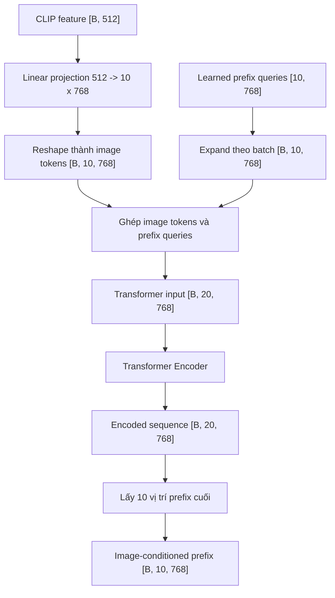
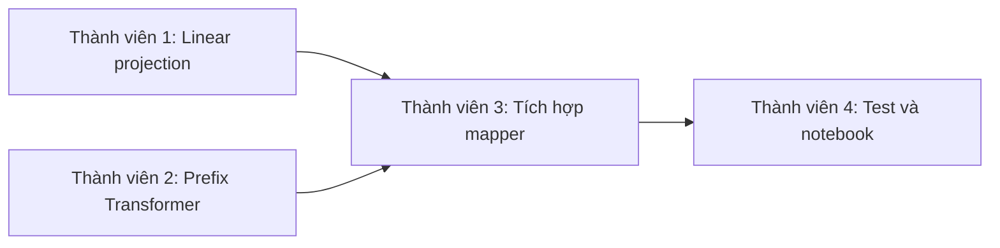

# Transformer Mapping Network cho CLIP Image Captioning

## 1. Mục tiêu tài liệu

Tài liệu này tổng hợp các nội dung đã thống nhất về mapping network nằm giữa CLIP và GPT-2, bao gồm:

- Bối cảnh và trạng thái hiện tại của dự án.
- Vấn đề mà mapping network phải giải quyết.
- Ý tưởng của Linear projection, image token và learned prefix query.
- Cách Transformer Encoder tạo ra 10 prefix embedding.
- Kích thước tensor qua từng bước.
- Cách chia công việc giữa các thành viên.
- Tiêu chí kiểm thử và điều kiện hoàn thành.
- Những quyết định còn cần cả nhóm thống nhất.

Notebook review đã được thảo luận với đường dẫn dự kiến:

```text
notebook/modeling/transformer_mapper.ipynb
```

Tại thời điểm cập nhật tài liệu này, notebook trên không có trong working tree. Nhóm cần tạo hoặc khôi phục notebook trước bước review. Hiện tại cũng chưa thêm implementation chính thức vào `src/models`.

## 2. Trạng thái pipeline

Theo tiến độ của nhóm, các bước sau đã hoàn thành:

1. Đưa ảnh qua CLIP.
2. Thu được global image feature 512 chiều cho mỗi ảnh.
3. Tokenize caption.
4. Chuyển caption token thành GPT-2 token embedding.

Hai phía đang có dạng:

```text
CLIP image features:       [B, 512]
GPT-2 caption embeddings:  [B, caption_length, 768]
```

Trong đó:

- `B` là batch size.
- `512` là chiều output của CLIP ViT-B/32.
- `768` là chiều token embedding của GPT-2 base.

Phần còn thiếu là biến đổi CLIP feature thành một chuỗi embedding có cùng chiều với GPT-2:

```text
[B, 512] -> [B, prefix_length, 768]
```

Với cấu hình ban đầu `prefix_length=10`:

```text
[B, 512] -> [B, 10, 768]
```

Mười vector đầu ra không phải token ID và không cần thuộc từ điển GPT-2. Chúng là các continuous embedding, hay còn gọi là soft prefix, dùng để điều kiện hóa GPT-2 theo nội dung ảnh.

## 3. Luồng Transformer mapper



Tóm tắt bằng ký hiệu:

```text
x                       : CLIP feature [B, 512]
Z = reshape(Wx + b)     : image tokens [B, 10, 768]
P                       : learned queries [10, 768]
P_batch                 : expanded queries [B, 10, 768]
H0 = concat(Z, P_batch) : mapper input [B, 20, 768]
HL = Transformer(H0)    : encoded sequence [B, 20, 768]
prefix = HL[:, 10:, :]  : output [B, 10, 768]
```

## 4. Tại sao cần Linear projection?

### 4.1. Đổi không gian CLIP sang không gian GPT-2

CLIP feature có chiều `512`, trong khi GPT-2 base sử dụng embedding chiều `768`. Không thể ghép trực tiếp hai tensor này trên trục sequence.

Ít nhất cần một phép biến đổi:

```text
512 -> 768
```

Trong Transformer mapper, Linear layer tạo nhiều token cùng lúc:

```python
self.clip_projection = nn.Linear(
    in_features=512,
    out_features=10 * 768,
)
```

Sau projection:

```text
[B, 512] -> [B, 7680]
```

Sau reshape:

```text
[B, 7680] -> [B, 10, 768]
```

### 4.2. Tạo một chuỗi để Transformer xử lý

Attention có ý nghĩa nhất khi có nhiều token để lựa chọn và kết hợp. Nếu chỉ đưa một token vào Transformer, token đó chỉ attention vào chính nó và trọng số attention luôn bằng 1.

Linear projection sử dụng các nhóm trọng số khác nhau để tạo nhiều cách biểu diễn từ cùng một CLIP vector:

```text
W1 đọc CLIP vector -> image token v1
W2 đọc CLIP vector -> image token v2
...
W10 đọc CLIP vector -> image token v10
```

Mô hình có thể học để các token thiên về những khía cạnh khác nhau như đối tượng, hành động, thuộc tính hoặc bối cảnh. Đây chỉ là cách diễn giải trực giác; nhóm không gán ý nghĩa cố định cho từng token.

Linear projection không tạo thêm thông tin mà CLIP chưa có. Nó tổ chức lại global feature thành nhiều learned subspace để Transformer có thể xử lý dưới dạng sequence.

## 5. Image token là gì?

Image token là kết quả trực tiếp của Linear projection:

```text
v1, v2, ..., v10
```

Đặc điểm:

- Thay đổi theo từng ảnh.
- Chứa dữ liệu bắt nguồn từ CLIP feature.
- Đóng vai trò bộ nhớ ảnh bên trong mapper.
- Không được đưa trực tiếp ra ngoài trong thiết kế hiện tại.

Ví dụ:

```text
Ảnh chó -> image_tokens_dog [10, 768]
Ảnh xe  -> image_tokens_car [10, 768]
```

Do đầu vào CLIP hiện tại là global embedding `[B,512]`, 10 image token không phải 10 vùng không gian thực của ảnh. Chúng là 10 phép chiếu học được từ cùng một vector toàn cục.

Nếu tương lai cần biểu diễn vị trí vật thể chi tiết, nhóm có thể nghiên cứu lấy patch token từ CLIP image encoder thay vì chỉ dùng global embedding.

## 6. Learned prefix query là gì?

Mapper tạo một tensor tham số:

```python
self.prefix_embeddings = nn.Parameter(
    torch.randn(prefix_length, embedding_dim)
)
```

Với cấu hình ban đầu:

```text
[10, 768]
```

Đặc điểm trước khi vào Transformer:

- Là tham số được huấn luyện.
- Giống nhau cho mọi ảnh.
- Không chứa trực tiếp CLIP feature.
- Đóng vai trò các vị trí đầu ra cần đọc thông tin ảnh.

Prefix query được mở rộng theo batch bằng `expand`:

```python
prefix_queries = self.prefix_embeddings.unsqueeze(0).expand(
    batch_size,
    -1,
    -1,
)
```

Kết quả:

```text
[10, 768] -> [B, 10, 768]
```

`expand` không tạo một bản sao tham số độc lập cho từng ảnh. Mọi sample vẫn sử dụng chung một bộ query và gradient được cộng dồn về cùng tham số gốc.

Có thể hình dung 10 query là 10 ô đầu ra trống. Transformer đọc image token và điền thông tin phù hợp vào các ô này.

## 7. Image token và prefix query khác nhau thế nào?

| Thành phần | Thay đổi theo ảnh trước Transformer? | Vai trò |
|---|---:|---|
| Image token `v1...v10` | Có | Bộ nhớ chứa dữ liệu ảnh |
| Prefix query `p1...p10` | Không | Các vị trí đầu ra học được |
| Prefix sau Transformer `p1'...p10'` | Có | Soft prompt đã chứa thông tin ảnh |

Hai tensor có thể cùng shape `[B,10,768]`, nhưng nguồn gốc và vai trò khác nhau hoàn toàn.

## 8. Transformer Encoder làm gì?

Image token và prefix query được ghép trên trục sequence:

```python
mapper_input = torch.cat(
    (image_tokens, prefix_queries),
    dim=1,
)
```

Shape:

```text
image_tokens:      [B, 10, 768]
prefix_queries:    [B, 10, 768]
transformer_input: [B, 20, 768]
```

Transformer Encoder sử dụng self-attention trên toàn bộ 20 token. Mỗi prefix query có thể attention vào tất cả image token và các prefix query khác.

Với một prefix query `pj`, quá trình được đơn giản hóa như sau:

```text
pj' = pj + tổng có trọng số của thông tin từ image tokens
         + thông tin phối hợp từ các prefix queries khác
```

Trọng số được học thông qua attention:

```text
Q = XWq
K = XWk
V = XWv
Attention(Q,K,V) = softmax(QK^T / sqrt(dk))V
```

Sau nhiều Transformer layer, mỗi prefix query trở thành một vector phụ thuộc vào ảnh. Một cách diễn giải trực giác là:

```text
p1' có thể thiên về đối tượng chính
p2' có thể thiên về hành động
p3' có thể thiên về bối cảnh
```

Đây không phải nhãn được gán trước. Caption loss sẽ quyết định mô hình cần tổ chức thông tin như thế nào để GPT-2 dự đoán tốt hơn.

## 9. Tại sao chỉ lấy 10 prefix token cuối?

Transformer trả về cùng số token với input:

```text
[B, 20, 768]
```

Bao gồm:

```text
10 encoded image tokens + 10 encoded prefix queries
```

Mapper chỉ lấy phần prefix:

```python
prefix_embeddings = encoded[:, self.clip_length:, :]
```

Kết quả:

```text
[B, 10, 768]
```

Image token là bộ nhớ nội bộ. Encoded prefix query là giao diện đầu ra dành cho GPT-2.

## 10. Tại sao không dùng causal mask trong mapper?

Mapper không sinh văn bản theo thứ tự trái sang phải. Nó chỉ chuyển một biểu diễn ảnh cố định thành một chuỗi prefix cố định.

Vì vậy, mọi token trong mapper được phép nhìn thấy nhau:

```text
prefix query có thể đọc mọi image token
image token có thể tương tác với mọi prefix query
prefix query có thể phối hợp với prefix query khác
```

Causal mask chỉ cần ở GPT-2, nơi token hiện tại không được nhìn token văn bản tương lai.

## 11. Số 10 có ý nghĩa gì?

Số 10 không phải quy tắc bắt buộc. Đây là hyperparameter.

```text
clip_length   = số image token nội bộ
prefix_length = số soft-prefix token đưa cho GPT-2
```

Hai giá trị không bắt buộc bằng nhau:

```text
clip_length=5,  prefix_length=10
clip_length=10, prefix_length=5
```

Khi cùng đặt bằng 10, luồng dễ kiểm tra và bám gần thiết kế ClipCap-style phổ biến. Nhóm nên coi đây là baseline để thí nghiệm, không phải giá trị tối ưu đã được chứng minh cho Flickr8k.

## 12. Transformer mapper có bắt buộc không?

Không. Có hai phương án chính.

### Phương án A: Linear hoặc MLP mapper

```text
CLIP [B,512]
    -> Linear/MLP
    -> reshape [B,10,768]
    -> GPT-2
```

Ưu điểm:

- Đơn giản.
- Ít tham số.
- Dễ debug và huấn luyện.

Nhược điểm:

- Prefix được tạo trực tiếp, không có attention để các vị trí phối hợp.
- Khả năng chuyển đổi biểu diễn hạn chế hơn.

### Phương án B: Transformer mapper

```text
CLIP
    -> image-token memory
    -> learned prefix queries đọc memory bằng attention
    -> image-conditioned prefix
    -> GPT-2
```

Ưu điểm:

- Có khả năng biểu diễn mạnh hơn.
- Prefix token có thể phối hợp với nhau.
- Phù hợp khi muốn đóng băng GPT-2 và để mapper học phần kết nối ảnh-văn bản.

Nhược điểm:

- Nhiều tham số và tốn bộ nhớ hơn.
- Có nguy cơ overfit trên Flickr8k.
- Phức tạp hơn khi kiểm thử.

Nhóm hiện chọn nghiên cứu phương án Transformer mapping.

## 13. Cấu hình baseline đề xuất

```text
clip_dim        = 512
embedding_dim   = 768
clip_length     = 10
prefix_length   = 10
num_heads       = 8
num_layers      = 4
dropout         = 0.1
feedforward_dim = 3072
```

Giải thích:

- `clip_dim=512`: khớp CLIP ViT-B/32.
- `embedding_dim=768`: khớp GPT-2 base.
- `num_heads=8`: 768 chia hết cho 8, mỗi head có dimension 96.
- `feedforward_dim=3072`: bằng `4 * embedding_dim`.
- `num_layers=4`: cân bằng giữa khả năng biểu diễn và nguy cơ overfit.

Notebook hiện đặt constructor mặc định là 8 layer để thể hiện cấu hình ClipCap-style, nhưng cell smoke test dùng 2 layer để chạy nhanh. Trước khi chuyển vào `src/models`, nhóm cần thống nhất mặc định cuối cùng. Đề xuất cho Flickr8k là bắt đầu bằng 4 layer.

Về chiến lược train:

1. Đóng băng CLIP.
2. Ban đầu đóng băng GPT-2 và chỉ train mapper.
3. Nếu chất lượng bị giới hạn, có thể mở một số block cuối của GPT-2 với learning rate nhỏ.

## 14. Giao diện module dự kiến

Phạm vi mapper không phụ thuộc tokenizer hoặc GPT-2.

```python
class TransformerMapper(nn.Module):
    def __init__(
        self,
        clip_dim: int,
        embedding_dim: int,
        prefix_length: int,
        clip_length: int,
        num_layers: int,
        num_heads: int,
        dropout: float,
    ) -> None:
        ...

    def forward(self, clip_features: Tensor) -> Tensor:
        ...
```

Hợp đồng bắt buộc:

```text
Input:  FloatTensor [B, 512]
Output: FloatTensor [B, 10, 768]
```

Forward dự kiến:

```python
batch_size = clip_features.shape[0]

image_tokens = self.clip_projection(clip_features).reshape(
    batch_size,
    self.clip_length,
    self.embedding_dim,
)

prefix_queries = self.prefix_embeddings.unsqueeze(0).expand(
    batch_size,
    -1,
    -1,
)

mapper_input = torch.cat(
    (image_tokens, prefix_queries),
    dim=1,
)

encoded = self.transformer(mapper_input)
prefix_embeddings = encoded[:, self.clip_length:, :]

return prefix_embeddings
```

## 15. Cách nối với GPT-2 ở giai đoạn tiếp theo

Phần này nằm ngoài phạm vi mapper hiện tại, nhưng cần thống nhất interface từ sớm.

Caption token embedding:

```python
caption_embeddings = gpt2.transformer.wte(input_ids)
```

Shape:

```text
[B, caption_length, 768]
```

Ghép prefix phía trước caption:

```python
gpt_inputs = torch.cat(
    (prefix_embeddings, caption_embeddings),
    dim=1,
)
```

Với `prefix_length=10` và `caption_length=48`:

```text
[B,10,768] + [B,48,768] -> [B,58,768]
```

Attention mask cần thêm 10 giá trị 1 phía trước:

```text
prefix_attention_mask:  [B,10] toàn giá trị 1
caption_attention_mask: [B,48]
combined_mask:          [B,58]
```

Labels cần thêm 10 giá trị `-100` phía trước để caption loss bỏ qua các vị trí prefix:

```text
prefix_labels:  [B,10] toàn giá trị -100
caption_labels: [B,48]
combined_labels:[B,58]
```

## 16. Phân công cho nhóm 4 thành viên

| Thành viên | Phần phụ trách | Đầu vào | Đầu ra |
|---|---|---|---|
| Thành viên 1 | Linear projection và image token | `[B,512]` | `[B,10,768]` |
| Thành viên 2 | Learned prefix query và Transformer Encoder | Image token giả `[B,10,768]` | Encoded sequence `[B,20,768]` |
| Thành viên 3 | Tích hợp thành `TransformerMapper` | `[B,512]` | Prefix `[B,10,768]` |
| Thành viên 4 | Notebook, unit test và kiểm chứng | Mapper hoàn chỉnh | Kết quả test và báo cáo |

### 16.1. Thành viên 1: Linear projection

Nhiệm vụ:

- Tạo `nn.Linear(512, 10 * 768)`.
- Reshape output thành `[B,10,768]`.
- Không dùng vòng lặp để tạo từng token.
- Kiểm tra input shape.
- Kiểm tra gradient đến `projection.weight`.

Interface bàn giao:

```python
class ClipProjection(nn.Module):
    def forward(self, clip_features):
        # Returns [B, 10, 768]
        ...
```

### 16.2. Thành viên 2: Prefix query và Transformer

Thành viên này có thể làm song song với thành viên 1 bằng input giả:

```python
image_tokens = torch.randn(B, 10, 768)
```

Nhiệm vụ:

- Tạo learned prefix query `[10,768]`.
- Expand thành `[B,10,768]`.
- Ghép thành `[B,20,768]`.
- Cấu hình Transformer Encoder.
- Không dùng causal mask.
- Trả encoded sequence `[B,20,768]`.

Interface bàn giao:

```python
class PrefixTransformer(nn.Module):
    def forward(self, image_tokens):
        # Returns [B, 20, 768]
        ...
```

### 16.3. Thành viên 3: Tích hợp mapper

Nhiệm vụ:

- Ghép hai phần trên thành một module.
- Lấy đúng các vị trí prefix cuối.
- Không hard-code số 10 trong `forward`; sử dụng `self.clip_length` và `self.prefix_length`.
- Validate toàn bộ cấu hình.
- Kiểm tra `embedding_dim % num_heads == 0`.
- Kiểm tra nhiều batch size.
- Đếm số lượng tham số.

### 16.4. Thành viên 4: Test và notebook

Nhiệm vụ:

- Hoàn thiện notebook review.
- Viết unit test cho mapper.
- Kiểm tra bằng tensor giả và CLIP feature thật.
- Ghi lại shape, gradient, thời gian forward và bộ nhớ GPU nếu có CUDA.

Luồng phụ thuộc:



Nếu nhóm có 3 người, thành viên tích hợp có thể kiêm test. Nếu nhóm có 2 người, một người phụ trách projection và Transformer core, người còn lại phụ trách tích hợp, test và notebook.

## 17. Kế hoạch kiểm thử

### 17.1. Shape test

```text
[1,512]  -> [1,10,768]
[4,512]  -> [4,10,768]
[32,512] -> [32,10,768]
```

### 17.2. Finite-value test

```python
assert torch.isfinite(output).all()
```

### 17.3. Gradient test

Gradient phải đến được:

- CLIP projection weight.
- Learned prefix embeddings.
- Transformer attention parameters.
- Transformer feed-forward parameters.

Ví dụ:

```python
loss = weighted_output.mean()
loss.backward()

assert mapper.clip_projection.weight.grad is not None
assert mapper.prefix_embeddings.grad is not None
```

Gradient phải hữu hạn và có ít nhất một phần tử khác 0.

### 17.4. Input validation test

Các input sau phải bị từ chối:

```text
[B,511]
[B,513]
[B,1,512]
```

Các cấu hình sau phải bị từ chối:

```text
prefix_length <= 0
clip_length <= 0
num_layers <= 0
num_heads <= 0
embedding_dim không chia hết cho num_heads
dropout < 0 hoặc dropout >= 1
```

### 17.5. Test với CLIP feature thật

```python
clip_data = torch.load(
    "data/flickr8k/features/clip_features.pt"
)

features = clip_data["features"][:4]
prefix = mapper(features)

assert prefix.shape == (4, 10, 768)
assert torch.isfinite(prefix).all()
```

### 17.6. Train/eval behavior

- Trong `train()` mode, dropout được bật.
- Trong `eval()` mode, cùng input phải cho output ổn định.
- Model phải di chuyển được giữa CPU và CUDA bằng `.to(device)`.
- Không tự tạo tensor trên sai device.

## 18. Definition of Done

Phần Transformer mapping được coi là hoàn thành khi:

1. Nhận CLIP feature `[B,512]`.
2. Trả chính xác prefix embedding `[B,10,768]`.
3. Output không chứa `NaN` hoặc `Inf`.
4. Gradient đến được Linear projection, prefix query và Transformer.
5. Chạy được với CLIP feature thật trong `clip_features.pt`.
6. Unit test shape và validation đều pass.
7. Notebook chạy tuần tự thành công.
8. Mapper không phụ thuộc tokenizer hoặc GPT-2.
9. Không sửa các bước preprocessing đã hoàn thành.
10. Cả nhóm review notebook trước khi chuyển implementation vào `src/models`.

## 19. Rủi ro và giới hạn

### 19.1. Overfitting

Flickr8k là dataset nhỏ, trong khi Transformer mapper 8 layer có thể có khoảng 60 triệu tham số. Nên bắt đầu bằng 2 đến 4 layer và theo dõi train/validation loss.

### 19.2. Global CLIP feature mất thông tin không gian

Mapper hiện nhận một vector toàn cục 512 chiều. Linear projection thành 10 token không khôi phục được thông tin đã mất, chẳng hạn vị trí chính xác của vật thể.

### 19.3. Prefix quá dài

Prefix dài làm tăng sequence length của GPT-2, kéo theo chi phí attention và bộ nhớ. Cần so sánh ít nhất một vài giá trị như 5, 10 và 20.

### 19.4. GPT-2 bị đóng băng hoàn toàn

Đóng băng GPT-2 giúp giảm trainable parameters nhưng bắt mapper phải chuyển CLIP feature vào đúng không gian embedding mà GPT-2 đã học. Nếu mapper không đủ khả năng, chất lượng caption có thể bị giới hạn.

## 20. Các quyết định còn cần thống nhất

1. Dùng mặc định 4 hay 8 Transformer layer?
2. Giữ `clip_length=10` và `prefix_length=10` cho baseline hay không?
3. Giai đoạn đầu đóng băng toàn bộ GPT-2 hay mở một số block cuối?
4. Có tách `ClipProjection` và `PrefixTransformer` thành hai class công khai hay chỉ giữ một `TransformerMapper` duy nhất?
5. Hyperparameter production được tập trung trong `src/config/clipcap_config.py`.
6. Có cần benchmark thêm MLP mapper để làm baseline so sánh không?
7. Tiêu chí chọn model tốt nhất là validation loss, BLEU, METEOR, ROUGE-L, CIDEr hay kết hợp nhiều metric?

## 21. Phạm vi bước tiếp theo

Sau khi cả nhóm duyệt notebook và trả lời các câu hỏi trên, bước implementation dự kiến là:

```text
src/models/__init__.py
src/models/transformer_mapper.py
tests/test_transformer_mapper.py
```

Chỉ sau khi mapper đã được kiểm thử độc lập mới tiếp tục sang model ghép prefix embedding với GPT-2.
